# homelab-manifests

Kubernetes manifests for my home lab running on Talos Linux.

## Architecture

```mermaid
flowchart TB
    subgraph Internet
        CF[Cloudflare Tunnel]
    end

    subgraph Public["Public Access (*.asandov.com)"]
        auth_pub[auth.asandov.com]
        jf_pub[jellyfin.asandov.com]
        js_pub[jellyseerr.asandov.com]
    end

    subgraph Local["Local Access (*.asandov.local)"]
        auth_loc[authentik.asandov.local]
        jf_loc[jellyfin.asandov.local]
        js_loc[jellyseerr.asandov.local]
        sonarr_loc[sonarr.asandov.local]
        radarr_loc[radarr.asandov.local]
        prowlarr_loc[prowlarr.asandov.local]
        sabnzbd_loc[sabnzbd.asandov.local]
        bazarr_loc[bazarr.asandov.local]
        grafana_loc[grafana.asandov.local]
    end

    subgraph Ingress["Ingress Controllers"]
        traefik[Traefik]
        nginx[NGINX]
        cftunnel[Cloudflare Tunnel Controller]
    end

    subgraph Cluster["Talos Kubernetes Cluster"]
        subgraph Nodes
            dell[talos-dell<br/>10.0.1.28<br/>control-plane]
            eggbert[talos-eggbert<br/>10.0.1.37<br/>control-plane]
            ratty[talos-rattypatty<br/>10.0.1.36<br/>control-plane]
        end

        subgraph Auth["Authentication"]
            authentik[Authentik]
            ldap[LDAP Outpost]
        end

        subgraph Media["Media Stack"]
            jellyseerr[Jellyseerr]
            sonarr[Sonarr]
            radarr[Radarr]
            prowlarr[Prowlarr]
            sabnzbd[SABnzbd]
            bazarr[Bazarr]
            gluetun[Gluetun VPN]
        end

        subgraph Monitoring["Monitoring (exporters only)"]
            prom_agent[Prometheus Agent]
            node_exp[Node Exporters]
            kube_state[kube-state-metrics]
        end

        subgraph ClusterSvcs["Cluster Services"]
            argocd[ArgoCD]
            metallb[MetalLB]
            externaldns[ExternalDNS]
            certmgr[Democratic-CSI]
        end
    end

    subgraph External["External Services"]
        truenas[TrueNAS Scale]
        subgraph TrueNAS_Apps["TrueNAS Apps"]
            jellyfin_tn[Jellyfin]
            prometheus_tn[Prometheus]
            grafana_tn[Grafana]
        end
        nfs[(NFS Storage)]
        opnsense[OPNsense<br/>Router + DNS]
        windscribe[Windscribe VPN]
    end

    CF --> cftunnel
    cftunnel --> auth_pub & jf_pub & js_pub

    auth_pub --> authentik
    jf_pub --> jellyfin_tn
    js_pub --> jellyseerr

    traefik --> auth_loc & js_loc & sonarr_loc & radarr_loc & prowlarr_loc & sabnzbd_loc & bazarr_loc
    nginx --> jf_loc & grafana_loc

    auth_loc --> authentik
    jf_loc --> jellyfin_tn
    js_loc --> jellyseerr
    sonarr_loc --> sonarr
    radarr_loc --> radarr
    prowlarr_loc --> prowlarr
    sabnzbd_loc --> sabnzbd
    bazarr_loc --> bazarr
    grafana_loc --> grafana_tn

    authentik --> ldap
    ldap -->|LDAP Auth| jellyfin_tn

    sabnzbd --> gluetun --> windscribe

    prom_agent -->|remote write| prometheus_tn
    Media --> nfs
    externaldns --> opnsense
    certmgr --> nfs
```



## Infrastructure

### Kubernetes Cluster
All services run on a 3-node Talos Linux cluster:

| Node | IP | Role | Hardware | RAM |
|------|-----|------|----------|-----|
| talos-dell | 10.0.1.28 | control-plane | Mini PC, i7-4510U | 16GB |
| talos-eggbert | 10.0.1.37 | control-plane | Raspberry Pi 4 | 4GB |
| talos-rattypatty | 10.0.1.36 | control-plane | Raspberry Pi 4 | 2GB |

- **OS**: Talos Linux v1.11.2
- **Container Runtime**: containerd 2.1.4

### Storage
The cluster is diskless - all persistent storage is provided by a separate **TrueNAS Scale** server via NFS.

- **Democratic-CSI** - Dynamic NFS provisioner for PVCs
- **Jellyfin** also runs directly on TrueNAS (not in cluster)

### Network
- **OPNsense** - Router, firewall, DNS (Unbound)
- **MetalLB** - Load balancer for bare metal
- **ExternalDNS** - Automatic DNS record management to OPNsense

## Applications

| App | Local URL | Public URL | Auth | Runs On |
|-----|-----------|------------|------|---------|
| Authentik | authentik.asandov.local | auth.asandov.com | - | Cluster |
| Jellyfin | jellyfin.asandov.local | jellyfin.asandov.com | LDAP | TrueNAS |
| Jellyseerr | jellyseerr.asandov.local | jellyseerr.asandov.com | OIDC | Cluster |
| Sonarr | sonarr.asandov.local | - | Forward Auth | Cluster |
| Radarr | radarr.asandov.local | - | Forward Auth | Cluster |
| Prowlarr | prowlarr.asandov.local | - | Forward Auth | Cluster |
| SABnzbd | sabnzbd.asandov.local | - | Forward Auth | Cluster |
| Bazarr | bazarr.asandov.local | - | Forward Auth | Cluster |
| Grafana | grafana.asandov.local | - | - | TrueNAS |
| Prometheus | - | - | - | TrueNAS |
| ArgoCD | argocd.asandov.local | - | - | Cluster |

## GitOps

All deployments are managed via **ArgoCD** with manifests in this repository.

```
talos/
├── argocd/           # ArgoCD self-management
├── authentik/        # SSO provider
├── cluster-services/ # Traefik, external-dns, democratic-csi
├── kube-prom-stack/  # Prometheus, Grafana, Alertmanager
├── media-v2/         # Jellyseerr, *arr stack, SABnzbd
└── ...
```
