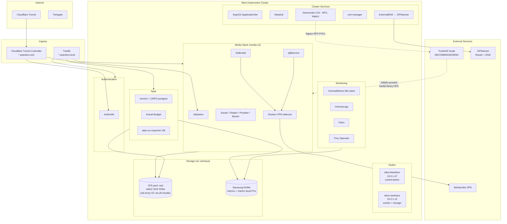

# homelab-manifests

Kubernetes manifests for my home lab running on Talos Linux.

## Architecture


```mermaid
flowchart TB
    subgraph Internet
        CF[Cloudflare Tunnel]
        TG[Twingate]
    end

    subgraph Ingress["Ingress"]
        traefik[Traefik<br/>*.asandov.local]
        cftunnel[Cloudflare Tunnel Controller<br/>*.asandov.com]
    end

    subgraph Cluster["Talos Kubernetes Cluster"]
        subgraph Nodes
            blackbox[talos-blackbox<br/>10.0.1.47<br/>control-plane]
            ramhaus[talos-ramhaus<br/>10.0.1.12<br/>worker + storage]
        end

        subgraph Auth["Authentication"]
            authentik[Authentik]
        end

        subgraph Media["Media Stack (media-v2)"]
            jellyseerr[Jellyseerr]
            arr[Sonarr / Radarr / Prowlarr / Bazarr]
            sabnzbd[SABnzbd]
            qbit[qBittorrent]
            gluetun[Gluetun VPN sidecars]
        end

        subgraph Apps["Apps"]
            immich[Immich + CNPG postgres]
            actualbudget[Actual Budget]
            aldovm[aldo-vm KubeVirt VM]
        end

        subgraph Monitoring["Monitoring"]
            vm[VictoriaMetrics k8s stack]
            vlogs[VictoriaLogs]
            falco[Falco]
            trivy[Trivy Operator]
        end

        subgraph Storage["Storage (on ramhaus)"]
            zfs[(ZFS pool: ssd<br/>raidz2 SAS SSDs<br/>ssd-array SC via zfs-localpv)]
            nvme[(Samsung NVMe<br/>metrics + interim local PVs)]
        end

        subgraph ClusterSvcs["Cluster Services"]
            argocd[ArgoCD ApplicationSet]
            metallb[MetalLB]
            externaldns[ExternalDNS → OPNsense]
            certmgr[cert-manager]
            dcsi[Democratic-CSI - NFS, legacy]
        end
    end

    subgraph External["External Services"]
        truenas[TrueNAS Scale<br/>DECOMMISSIONING]
        opnsense[OPNsense<br/>Router + DNS]
        windscribe[Windscribe VPN]
    end

    CF --> cftunnel
    traefik --> Auth & Media & Apps
    cftunnel --> authentik & jellyseerr
    sabnzbd & qbit --> gluetun --> windscribe
    externaldns --> opnsense
    Media --> zfs
    Apps --> zfs & nvme
    Monitoring --> nvme
    dcsi -.->|legacy NFS PVCs| truenas
    truenas -.->|Jellyfin proxied<br/>media library NFS| Media
```

## Infrastructure

### Kubernetes Cluster

| Node | IP | Role | Hardware |
|------|-----|------|----------|
| talos-blackbox | 10.0.1.47 | control-plane | (gvisor runtime) |
| talos-ramhaus | 10.0.1.12 | worker + all stateful storage | HP Z440, 128GB, LSI 9211-8i IT HBA |

- **OS**: Talos Linux v1.11.5 · **Kubernetes**: v1.33.4 · **Runtime**: containerd 2.1.5
- ramhaus boots from an Intel 750 NVMe (factory image with `zfs` +
  `nonfree-kmod-nvidia-production` + `nvidia-container-toolkit-production`
  extensions); config in `talos/config/`

### Storage

Storage is consolidating from a separate TrueNAS box onto **ramhaus-local ZFS**
(TrueNAS decommission in progress):

- **`ssd` pool** — raidz2 of 12G SAS SSDs on the 9211-8i (expanding to 6-wide)
- **`ssd-array` StorageClass** — OpenEBS zfs-localpv, dynamic per-PVC datasets
  on the `ssd` pool (`cluster-services/openebs-zfs-localpv/`)
- **Samsung NVMe** (`/var/mnt/metrics-storage`) — VictoriaMetrics/Logs data plus
  interim static local PVs (immich-postgres, sabnzbd scratch, trivy cache)
- **Democratic-CSI `truenas-nfs`** — legacy dynamic NFS PVCs against TrueNAS;
  being drained app-by-app onto `ssd-array`
- **TrueNAS (retiring)** — still serves the media library NFS + Jellyfin
  (proxied through cluster ingress) until cutover

### Network
- **OPNsense** — router, firewall, DNS (Unbound); records managed by ExternalDNS
- **MetalLB** — L2 load balancer
- **Traefik** — local ingress (`*.asandov.local`); **Cloudflare Tunnel** for
  public hostnames (`*.asandov.com`); **Twingate** for remote private access

## GitOps

Everything under `talos/` is deployed by **ArgoCD** via a single ApplicationSet
(`talos/argocd/resources/applicationset.yaml`) — a git directory generator that
auto-adopts new app directories (auto-sync, self-heal, prune). Helm charts are
vendored into each app dir (slow transit link; remote chart refs blow the
render timeout).

```
talos/
├── argocd/           # ArgoCD self-management + the ApplicationSet
├── authentik/        # SSO (OIDC / forward-auth / LDAP)
├── cluster-services/ # traefik, metallb, cert-manager, external-dns,
│                     # cnpg-operator, kubevirt+cdi, volsync, victoria-metrics,
│                     # victoria-logs, democratic-csi (legacy NFS),
│                     # openebs-zfs-localpv (ssd-array), cloudflare-tunnel
├── config/           # Talos machine configs (secrets encrypted as *.enc.yaml)
├── immich/           # Photos + CNPG postgres
├── media-v2/         # *arr stack, SABnzbd, Jellyseerr (+ gluetun sidecars)
├── qbittorrent/      # Torrents behind VPN
├── monitoring/       # opnsense-exporter, starlink
├── security/         # trivy-operator, falco
├── vms/              # KubeVirt VMs (aldo-vm)
└── ...               # actualbudget, maintainerr, tracearr, piper, status, twingate
```

Renovate keeps chart/image versions fresh via PRs.
