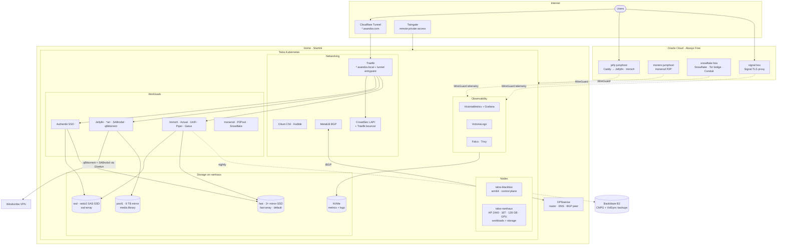
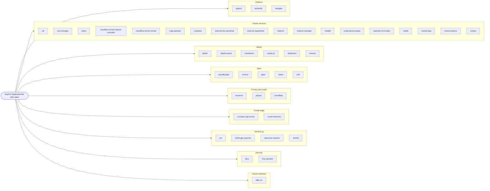

# homelab-manifests

GitOps manifests for my home lab: a two-node Talos Linux cluster, deployed by Argo CD from this repo.

## State

Live health comes from [Gatus at status.asandov.com](https://status.asandov.com), which probes the cluster from inside it:

| Service | Health | Uptime (7d) |
|---|---|---|
| Authentik |  |  |
| Jellyfin |  |  |
| Jellyseerr |  |  |
| Signal TLS proxy |  |  |
| Kubernetes API |  |  |
| VictoriaMetrics |  |  |
| VictoriaLogs |  |  |
| Lab DNS |  |  |

- **Validate manifests** renders every kustomization on each PR, checks it with kubeconform, and posts the rendered diff against `main`.
- **Renovate** runs weekly and opens PRs for Helm charts, annotated images and GitHub Actions ([docs/renovate-ci.md](docs/renovate-ci.md)).
- Sync state per app lives in Argo CD; alerts go to Discord through VMAlert and Alertmanager.

## Architecture

```mermaid
flowchart TB
    subgraph Internet
        users([Users])
        cf[Cloudflare Tunnel<br/>*.asandov.com]
        tg[Twingate<br/>remote private access]
    end

    subgraph Oracle["Oracle Cloud · Always Free"]
        jelly[jelly jumphost<br/>Caddy → Jellyfin · Immich]
        monero[monero jumphost<br/>monerod P2P]
        snow[snowflake box<br/>Snowflake · Tor bridge · Conduit]
        signal[signal box<br/>Signal TLS proxy]
    end

    subgraph Home["Home · Starlink"]
        opnsense[OPNsense<br/>router · DNS · BGP peer]

        subgraph Cluster["Talos Kubernetes"]
            subgraph Nodes
                blackbox[talos-blackbox<br/>arm64 · control plane]
                ramhaus[talos-ramhaus<br/>HP Z440 · 16T · 128 GB · GPU<br/>workloads + storage]
            end

            subgraph Net["Networking"]
                cilium[Cilium CNI · Hubble]
                metallb[MetalLB BGP]
                traefik[Traefik<br/>*.asandov.local + tunnel entrypoint]
                crowdsec[CrowdSec LAPI<br/>+ Traefik bouncer]
            end

            subgraph Workloads
                authentik[Authentik SSO]
                media[Jellyfin · *arr · SABnzbd · qBittorrent]
                apps[Immich · Actual · UniFi · Piper · Gatus]
                xmr[monerod · P2Pool · Snowflake]
            end

            subgraph Obs["Observability"]
                vm[VictoriaMetrics + Grafana]
                vl[VictoriaLogs]
                sec[Falco · Trivy]
            end

            subgraph Storage["Storage on ramhaus"]
                fast[(fast · 2× mirror SSD<br/>fast-array · default)]
                ssd[(ssd · raidz2 SAS SSD<br/>ssd-array)]
                pool1[(pool1 · 6 TB mirror<br/>media library)]
                nvme[(NVMe<br/>metrics + logs)]
            end
        end
    end

    b2[(Backblaze B2<br/>CNPG + VolSync backups)]
    windscribe[Windscribe VPN]

    users --> cf --> traefik
    users --> jelly & signal
    tg --> Cluster
    jelly & monero -.->|WireGuard| Cluster
    snow & signal -.->|WireGuard telemetry| Obs
    metallb <-->|iBGP| opnsense
    traefik --> crowdsec
    traefik --> authentik & media & apps
    media -->|qBittorrent + SABnzbd via Gluetun| windscribe
    media --> pool1
    apps & authentik --> ssd & fast
    Obs --> nvme
    apps -.->|nightly| b2
```

## App inventory

<!-- apps:start -->
<!-- Generated by .github/ci/gen-readme-apps.py from the ApplicationSet; do not edit by hand. -->

```mermaid
flowchart LR
    argocd_appset([ArgoCD ApplicationSet talos-apps])
    subgraph Platform["Platform"]
        app_argocd["argocd"]
        app_authentik["authentik"]
        app_twingate["twingate"]
    end
    argocd_appset --> Platform
    subgraph Cluster_services["Cluster services"]
        app_cdi["cdi"]
        app_cert_manager["cert-manager"]
        app_cilium["cilium"]
        app_cloudflare_tunnel_ingress_controller["cloudflare-tunnel-ingress-controller"]
        app_cloudflare_tunnel_remote["cloudflare-tunnel-remote"]
        app_cnpg_operator["cnpg-operator"]
        app_crowdsec["crowdsec"]
        app_external_dns_opnsense["external-dns-opnsense"]
        app_external_snapshotter["external-snapshotter"]
        app_kubevirt["kubevirt"]
        app_kubevirt_manager["kubevirt-manager"]
        app_metallb["metallb"]
        app_nvidia_device_plugin["nvidia-device-plugin"]
        app_openebs_zfs_localpv["openebs-zfs-localpv"]
        app_traefik["traefik"]
        app_victoria_logs["victoria-logs"]
        app_victoria_metrics["victoria-metrics"]
        app_volsync["volsync"]
    end
    argocd_appset --> Cluster_services
    subgraph Media["Media"]
        app_jellyfin["jellyfin"]
        app_jellyfin_tunnel["jellyfin-tunnel"]
        app_maintainerr["maintainerr"]
        app_media_v2["media-v2"]
        app_qbittorrent["qbittorrent"]
        app_tracearr["tracearr"]
    end
    argocd_appset --> Media
    subgraph Apps["Apps"]
        app_actualbudget["actualbudget"]
        app_immich["immich"]
        app_piper["piper"]
        app_status["status"]
        app_unifi["unifi"]
    end
    argocd_appset --> Apps
    subgraph Privacy_and_crypto["Privacy and crypto"]
        app_monerod["monerod"]
        app_p2pool["p2pool"]
        app_snowflake["snowflake"]
    end
    argocd_appset --> Privacy_and_crypto
    subgraph Oracle_edge["Oracle edge"]
        app_crowdsec_lapi_tunnel["crowdsec-lapi-tunnel"]
        app_oracle_telemetry["oracle-telemetry"]
    end
    argocd_appset --> Oracle_edge
    subgraph Monitoring["Monitoring"]
        app_nut["nut"]
        app_nvidia_gpu_exporter["nvidia-gpu-exporter"]
        app_opnsense_exporter["opnsense-exporter"]
        app_starlink["starlink"]
    end
    argocd_appset --> Monitoring
    subgraph Security["Security"]
        app_falco["falco"]
        app_trivy_operator["trivy-operator"]
    end
    argocd_appset --> Security
    subgraph Virtual_machines["Virtual machines"]
        app_aldo_vm["aldo-vm"]
    end
    argocd_appset --> Virtual_machines
```

**44 Argo CD applications.**

| Category | App | Namespace | Notes |
|---|---|---|---|
| Platform | [`argocd`](talos/argocd) | — | ArgoCD self-management: the argo-cd chart, this ApplicationSet, and the ingress sync from git like everything else |
| Platform | [`authentik`](talos/authentik) | authentik |  |
| Platform | [`twingate`](talos/twingate) | twingate |  |
| Cluster services | [`cdi`](talos/cluster-services/cdi) | — |  |
| Cluster services | [`cert-manager`](talos/cluster-services/cert-manager) | cert-manager |  |
| Cluster services | [`cilium`](talos/cluster-services/cilium) | — |  |
| Cluster services | [`cloudflare-tunnel-ingress-controller`](talos/cluster-services/cloudflare-tunnel-ingress-controller) | cloudflare-tunnel-ingress-controller |  |
| Cluster services | [`cloudflare-tunnel-remote`](talos/cluster-services/cloudflare-tunnel-remote) | cloudflare-tunnel-remote |  |
| Cluster services | [`cnpg-operator`](talos/cluster-services/cnpg-operator) | cnpg-system |  |
| Cluster services | [`crowdsec`](talos/cluster-services/crowdsec) | crowdsec |  |
| Cluster services | [`external-dns-opnsense`](talos/cluster-services/external-dns-opnsense) | — |  |
| Cluster services | [`external-snapshotter`](talos/cluster-services/external-snapshotter) | — |  |
| Cluster services | [`kubevirt`](talos/cluster-services/kubevirt) | — |  |
| Cluster services | [`kubevirt-manager`](talos/cluster-services/kubevirt-manager) | kubevirt-manager |  |
| Cluster services | [`metallb`](talos/cluster-services/metallb) | metallb-system |  |
| Cluster services | [`nvidia-device-plugin`](talos/cluster-services/nvidia-device-plugin) | nvidia-device-plugin |  |
| Cluster services | [`openebs-zfs-localpv`](talos/cluster-services/openebs-zfs-localpv) | openebs-zfs |  |
| Cluster services | [`traefik`](talos/cluster-services/traefik) | — |  |
| Cluster services | [`victoria-logs`](talos/cluster-services/victoria-logs) | monitoring |  |
| Cluster services | [`victoria-metrics`](talos/cluster-services/victoria-metrics) | monitoring |  |
| Cluster services | [`volsync`](talos/cluster-services/volsync) | volsync-system |  |
| Media | [`jellyfin`](talos/jellyfin) | jellyfin |  |
| Media | [`jellyfin-tunnel`](talos/jellyfin-tunnel) | jellyfin-tunnel | Home end of the WireGuard tunnel publishing jellyfin.asandov.com via the Oracle Cloud VPS |
| Media | [`maintainerr`](talos/maintainerr) | maintainerr |  |
| Media | [`media-v2`](talos/media-v2) | media-v2 |  |
| Media | [`qbittorrent`](talos/qbittorrent) | qbittorrent |  |
| Media | [`tracearr`](talos/tracearr) | tracearr |  |
| Apps | [`actualbudget`](talos/actualbudget) | actualbudget |  |
| Apps | [`immich`](talos/immich) | immich | Immich (photo management) |
| Apps | [`piper`](talos/piper) | piper | Piper (TTS) |
| Apps | [`status`](talos/status) | status | Status page |
| Apps | [`unifi`](talos/unifi) | unifi | UniFi controller |
| Privacy and crypto | [`monerod`](talos/monerod) | monerod | Monero node (P2P via Oracle, tx relay via Tor) |
| Privacy and crypto | [`p2pool`](talos/p2pool) | p2pool | P2Pool mini + built-in miner, off-peak schedule |
| Privacy and crypto | [`snowflake`](talos/snowflake) | snowflake | Tor Snowflake proxy (anti-censorship), egress locked to the internet |
| Oracle edge | [`crowdsec-lapi-tunnel`](talos/crowdsec-lapi-tunnel) | crowdsec-lapi-tunnel | WireGuard peers letting crowdsec-web-ui reach the Oracle LAPIs (privileged ns for NET_ADMIN) |
| Oracle edge | [`oracle-telemetry`](talos/oracle-telemetry) | oracle-telemetry | Oracle VPS node metrics (pulled) and journald (pushed, insert-only) over WireGuard (privileged ns for NET_ADMIN) |
| Monitoring | [`nut`](talos/monitoring/nut) | monitoring |  |
| Monitoring | [`nvidia-gpu-exporter`](talos/monitoring/nvidia-gpu-exporter) | monitoring |  |
| Monitoring | [`opnsense-exporter`](talos/monitoring/opnsense-exporter) | monitoring |  |
| Monitoring | [`starlink`](talos/monitoring/starlink) | monitoring |  |
| Security | [`falco`](talos/security/falco) | falco |  |
| Security | [`trivy-operator`](talos/security/trivy-operator) | trivy-system |  |
| Virtual machines | [`aldo-vm`](talos/vms/aldo-vm) | vms |  |
<!-- apps:end -->

## Infrastructure

### Nodes

| Node | Role | Hardware |
|---|---|---|
| talos-blackbox | control plane | arm64, 4 cores, 8 GB |
| talos-ramhaus | workloads and all stateful storage | HP Z440, Xeon E5-1660 v4 (16 threads), 128 GB, LSI 9211-8i IT HBA, NVIDIA GPU |

- **OS**: Talos Linux v1.11.5 · **Kubernetes**: v1.33.4 · **Runtime**: containerd 2.1.5
- ramhaus boots from an Intel 750 NVMe with the `zfs` and NVIDIA system extensions. Machine configs are SOPS-encrypted in `talos/config/`.

### Storage

All persistent data lives on ramhaus, as ZFS through OpenEBS zfs-localpv or as local PVs:

| Pool / disk | Layout | StorageClass | Used for |
|---|---|---|---|
| `fast` | two mirrored pairs of 960 GB SATA SSDs | `fast-array` (default) | app configs, SQLite, VM disks, Jellyfin |
| `ssd` | raidz2 of 480 GB SAS SSDs | `ssd-array` | Postgres (CNPG), Immich library, monerod |
| `ST6000NM0095-pool1` | 6 TB SAS mirror | `media-local` | media library and torrents (hardlinked, one copy) |
| Samsung NVMe | XFS | `vm-local`, `vlogs-local`, `trivy-local` | VictoriaMetrics, VictoriaLogs, scratch |

Backups: CNPG barman and VolSync restic go to Backblaze B2, and the Oracle boxes use free OCI boot-volume backups. See [docs/backup-and-recovery.md](docs/backup-and-recovery.md).

### Network and access

- **OPNsense**: router, firewall and DNS. ExternalDNS writes local records; MetalLB peers with it over iBGP ([docs/metallb-bgp-hairpin.md](docs/metallb-bgp-hairpin.md)).
- **Cilium**: CNI, with Hubble at `hubble.local` ([docs/cilium-migration.md](docs/cilium-migration.md)).
- **Traefik**: `*.asandov.local` behind Authentik forward-auth, plus a tunnel entrypoint that fronts Cloudflare Tunnel hosts through the CrowdSec bouncer.
- **Oracle jumphosts**: public Jellyfin and Immich (off Cloudflare, which caps uploads at 100 MB), monerod P2P, Tor Snowflake, bridge and Conduit, and a Signal TLS proxy. Each connects home over WireGuard and runs its own CrowdSec engine, node-exporter and journald shipping ([docs/oracle-wireguard-jumphost.md](docs/oracle-wireguard-jumphost.md)).
- **Twingate**: remote private access to the LAN.

## GitOps

Argo CD manages itself and everything else from the `talos-apps` ApplicationSet
(`talos/argocd/resources/applicationset.yaml`) with auto-sync, self-heal, prune and server-side apply.
`talos/cluster-services/*`, `talos/monitoring/*`, `talos/security/*` and `talos/vms/*` are discovered by glob.
Other apps are listed explicitly, and the comment above each entry becomes its note in the inventory.

- **Kustomize + Helm**: apps wrap charts with `helmCharts:`; charts from repos the CI runner can't reach are vendored.
- **Secrets**: SOPS with PGP, decrypted in the repo-server by ksops. Nothing is committed in plaintext.
- **Adding an app**: create `talos/<app>/kustomization.yaml`, add it to the ApplicationSet if it isn't under a globbed directory, then run `.github/ci/gen-readme-apps.py` so the inventory stays current. CI fails a PR whose README is stale.

## Docs

| Doc | Topic |
|---|---|
| [backup-and-recovery.md](docs/backup-and-recovery.md) | what is backed up, where, and how to restore |
| [oracle-wireguard-jumphost.md](docs/oracle-wireguard-jumphost.md) | Oracle boxes, WireGuard, egress budget |
| [crowdsec-plan.md](docs/crowdsec-plan.md) | CrowdSec phases ([operating it](talos/cluster-services/crowdsec/README.md)) |
| [cilium-migration.md](docs/cilium-migration.md) | flannel to Cilium cutover |
| [metallb-bgp-hairpin.md](docs/metallb-bgp-hairpin.md) | BGP LoadBalancer IPs and LAN hairpin |
| [renovate-ci.md](docs/renovate-ci.md) | Renovate and PR validation |
| [authentik-postgres-migration.md](docs/authentik-postgres-migration.md) | Authentik onto CNPG |
| [torrent-hardlink-migration.md](docs/torrent-hardlink-migration.md) | single-copy media with hardlinks |

Per-app notes: [jellyfin](talos/jellyfin/README.md), [monerod](talos/monerod/README.md), [p2pool](talos/p2pool/README.md), [unifi](talos/unifi/README.md).
